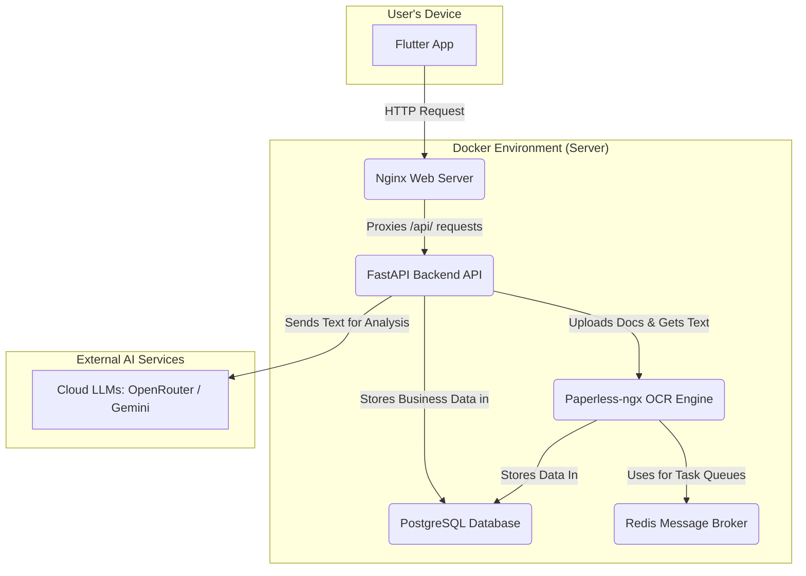

# BackPocket OS: Architectural Overview

**BackPocket OS is an AI-powered business operating system designed for Australian "tradies." It automates the administrative and financial "paperwork" of running a trade business—email triage, document analysis, quoting, and invoicing—allowing skilled tradespeople to focus on their work.**

This document provides a high-level overview of the system's architecture, data flow, and core technical principles.

---

## 1. Core Philosophy: The "Best of Both Worlds"

The system is built on a "best of both worlds" philosophy, combining the power of best-in-class open-source tools with a custom-built AI core.

- **We don't reinvent the wheel:** For solved problems like document OCR and database management, we use dedicated, powerful open-source systems (`Paperless-ngx`, `PostgreSQL`).
- **We focus on the "last mile":** Our custom AI logic is reserved for high-value, business-specific tasks like understanding a client's intent from an email, learning a user's communication style, and generating context-aware quotes.

This results in a system that is robust, scalable, and intelligent.

## 2. System Architecture: A Containerized Ecosystem

The entire BackPocket OS runs as a collection of containerized services orchestrated by **Docker Compose**. This provides a consistent, isolated, and easily deployable environment.



- **`web` (Nginx):** The front door. It serves the Flutter web application and acts as a reverse proxy, securely forwarding all API calls to the backend.
- **`api` (FastAPI):** The central nervous system. This Python application contains all the core business logic, from voice command processing to financial calculations.
- **`paperless-ngx`:** Our dedicated document specialist. It ingests images and PDFs, performs industrial-grade Optical Character Recognition (OCR), and archives the documents.
- **Databases (`PostgreSQL` & `SQLite`):**
    - **PostgreSQL:** A robust database used exclusively by the high-volume Paperless-ngx service.
    - **SQLite:** A simple, file-based database that stores the application's core business data (leads, quotes, user settings), making development and backups straightforward.

---

## 3. Key Data Pipelines

Understanding these data flows is key to understanding BackPocket OS.

#### **A. The Intelligent Document Pipeline**

This workflow transforms a raw document (like a PDF invoice) into structured, actionable data.

```mermaid
graph TD
    A[1. User Uploads Document] --> B{2. FastAPI Receives File};
    B --> C[3. File is sent to Paperless-ngx for OCR];
    subgraph "Polling Loop"
        B -- "Asks 'Are you done yet?'" --> C;
    end
    C -- "Returns Clean Text" --> B;
    B --> D[4. Clean text is sent to a Cloud AI Model];
    D --> E[5. AI returns semantic analysis (dates, amounts, summary)];
    E --> F[6. Analysis is saved to the database];
```

#### **B. The Voice-to-Action Pipeline**

This pipeline converts a spoken command from the user into a completed action in the system.

```mermaid
graph TD
    A[1. User speaks command] --> B{2. Audio is transcribed to text};
    B --> C[3. An AI 'Intent Classifier' identifies the goal (e.g., 'create_invoice')];
    C --> D{4. The system checks if it has all the needed info};
    D -- "No, needs 'quote_id'" --> A;
    D -- "Yes, has all info" --> E[5. The relevant action handler is executed];
    E --> F[6. A PDF is generated and the quote status is updated];
```

---

## 4. The "Personality Engine": How the AI Learns

The system learns a user's unique communication style through a sophisticated two-stage process.

1.  **Noise Filtering with `IsolationForest`:** Before learning, the system first filters the user's sent emails. It uses the **Isolation Forest** machine learning algorithm to identify and discard "outlier" emails—spam, automated replies, and marketing—that don't represent the user's true voice.

2.  **Style Capture with RAG:** The "clean" emails are then fed into a **Retrieval-Augmented Generation (RAG)** system. This creates a searchable knowledge base of the user's specific phrasing, tone, and vocabulary. When drafting a new email, the AI retrieves relevant examples from this knowledge base to ensure the new draft is a perfect match for the user's personality.

## 5. Extensibility: Plug-and-Play AI Models

The architecture is designed for flexibility, particularly regarding the AI models used.

- **Centralized AI Gateway:** All calls to external AI services are routed through a single, configurable "AI Provider" switch in the backend.
- **Offline Model Ready:** By changing a single environment variable (`AI_PROVIDER=ollama`), the entire system can be redirected to use a local, offline model (like Ollama) running on the user's own hardware.
- **User-Defined Keys:** The Flutter app's settings screen allows users to connect to their own server instances and use their own API keys, enabling a fully self-hosted and customized experience.

This "pluggable" design ensures that BackPocket OS is not locked into any single AI provider and is ready for a future of powerful, private, offline AI.
