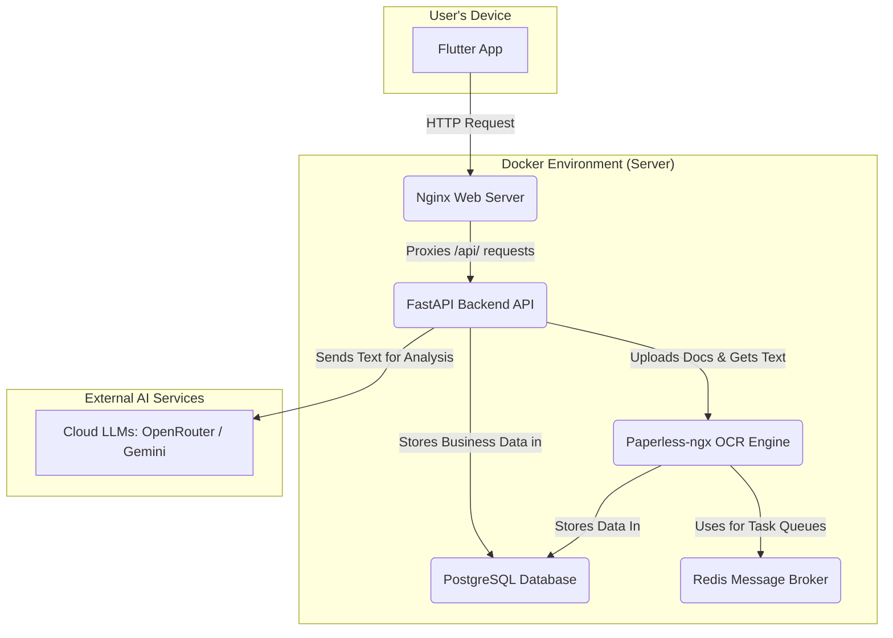
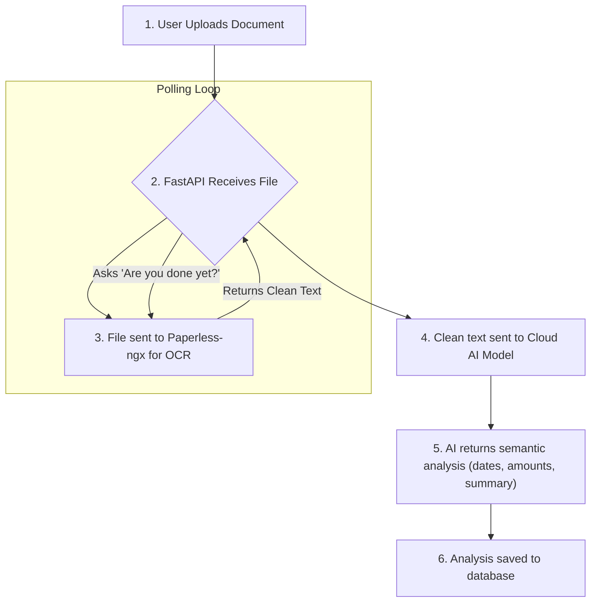
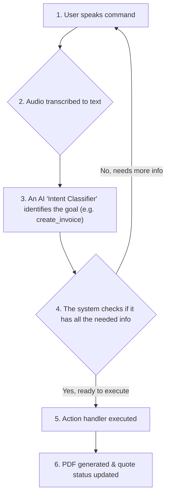
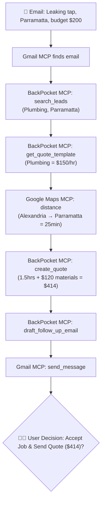
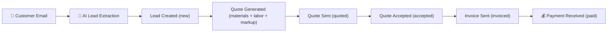
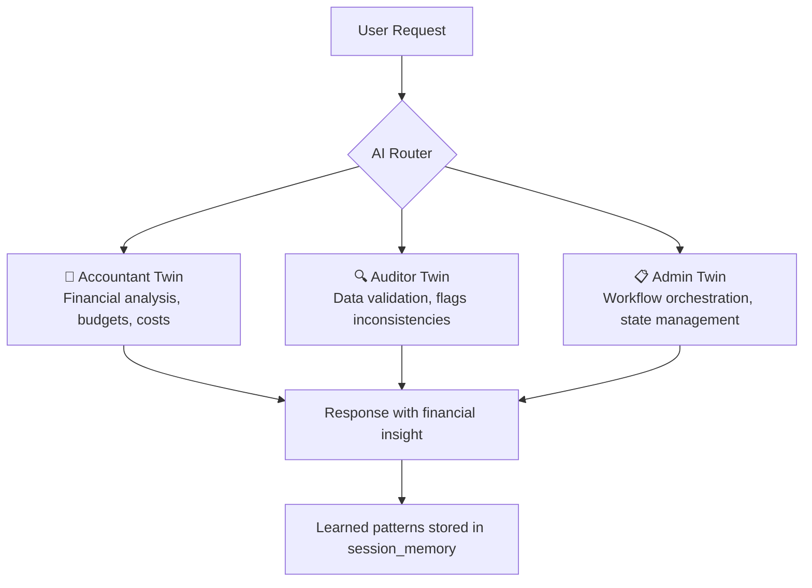
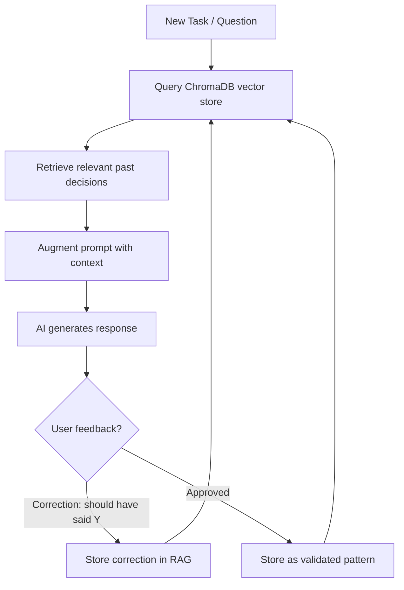
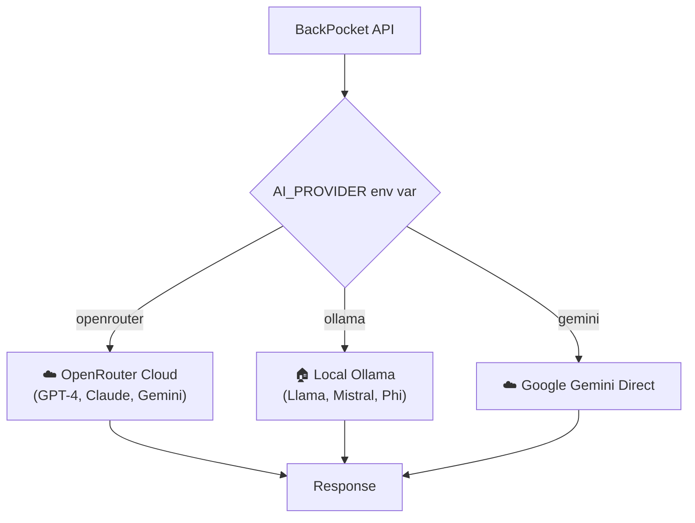

# BackPocket OS — Architecture Visuals

> Presentation-ready diagrams for meeting. Render in any Mermaid viewer (GitHub, VS Code preview, Mermaid.live, HackMD).

---

## 1. System Architecture

How all services connect in the containerized ecosystem.

---

## 2. Intelligent Document Pipeline

Raw document (PDF invoice, receipt photo) → structured, actionable business data.

---

## 3. Voice-to-Action Pipeline

Spoken commands from the tradie → completed system actions. Hands-free on the job site.

---

## 4. MCP Orchestrator — Real-World Example

End-to-end: email arrives → AI extracts lead → generates quote → calculates travel → sends response.

---

## 5. Personality Engine — How AI Learns Your Style

Two-stage process: filter noise from emails, then learn the tradie's communication style.

```mermaid
graph LR
    A["Raw Sent Emails"] --> B["Stage 1: IsolationForest Noise Filter"]
    B -- "Discard spam, auto-replies" --> C["Clean Emails (True Voice)"]
    C --> D["Stage 2: RAG Indexing (ChromaDB)"]
    D --> E["Searchable Style Knowledge Base"]
    E --> F["New Draft Request"]
    F --> G["AI retrieves similar past examples"]
    G --> H["Generated email matches user's tone"]
```

---

## 6. Full Business Pipeline (Lead → Payment)

Complete workflow from initial customer enquiry through to payment received.

---

## 7. Three AI Twins System

Specialized AI personas handling different business domains.

---

## 8. Agentic RAG Pipeline

How the system learns from past decisions and prevents hallucinations.

---

## 9. Offline / Sovereign Mode

Pluggable AI architecture — switch between cloud and local models.

---

## How to View These Diagrams

| Method | Instructions |
|--------|-------------|
| **GitHub** | Push this file — GitHub renders Mermaid natively |
| **VS Code** | Install "Markdown Preview Mermaid Support" extension |
| **Mermaid.live** | Paste any code block at [mermaid.live](https://mermaid.live) |
| **HackMD / Notion** | Paste directly — both render Mermaid |
| **Slides** | Screenshot from mermaid.live → paste into Google Slides/Keynote |

---

*BackPocket OS — Architecture Presentation — April 2026*